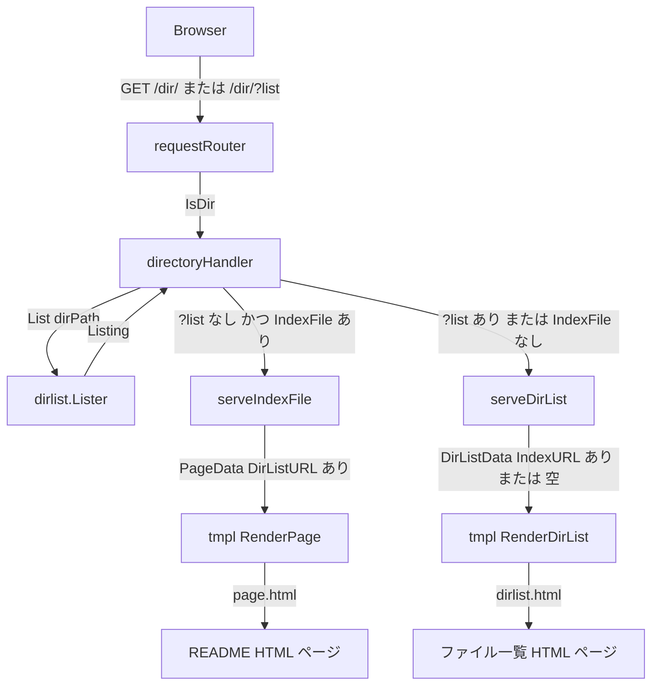
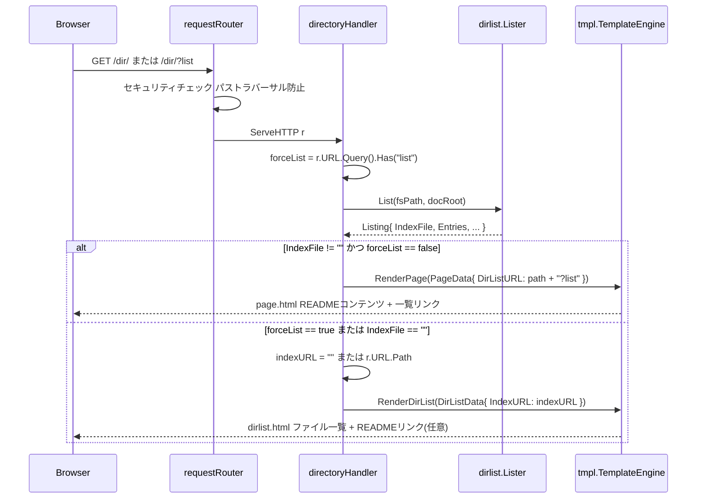

# Design Document: directory-listing-with-readme

## Overview

**Purpose**: README.md が存在するディレクトリでも、`?list` クエリパラメータを利用してファイル一覧ページへ直接アクセスできる仕組みと、ページ間の双方向ナビゲーションリンクを提供する。

**Users**: mdserve でローカル Markdown ドキュメントを閲覧するユーザー。特に `docs/` や `notes/` のように README.md と複数の Markdown ファイルが共存するディレクトリを閲覧する際に恩恵を受ける。

**Impact**: `directoryHandler` の分岐ロジックを変更し、`PageData` / `DirListData` にナビゲーション URL フィールドを追加することで、既存の README 優先表示動作を保持しつつ一覧へのアクセス手段を提供する。

### Goals

- `?list` クエリパラメータ付きディレクトリ URL で README.md の有無に関わらずファイル一覧を表示する
- README.md レンダリングページにファイル一覧へのリンクを表示する
- ファイル一覧ページに README.md が存在する場合、README へ戻るリンクを表示する
- 既存の動作（`?list` なし時の README 優先表示）を破壊しない

### Non-Goals

- `?list` 以外のクエリパラメータやサブパスによるアクセス手段の提供
- 一覧ページのソート・フィルタ機能
- 非 Markdown ファイル（画像・PDF 等）のリスト表示変更
- JavaScript によるクライアントサイドトグル

---

## Requirements Traceability

| Requirement | Summary | Components | Interfaces | Flows |
|-------------|---------|------------|------------|-------|
| 1.1 | `?list` 付きでリスト強制表示 | directoryHandler | `ServeHTTP` 分岐ロジック | ディレクトリリクエスト処理フロー |
| 1.2 | `?list` なしは既存動作を保持 | directoryHandler | `ServeHTTP` 分岐ロジック | ディレクトリリクエスト処理フロー |
| 1.3 | `?list` 付きでもセキュリティチェック適用 | requestRouter | `ServeHTTP`（変更なし） | — |
| 2.1 | README 表示時にファイル一覧リンクを表示 | directoryHandler, tmpl.PageData | `serveIndexFile`, `PageData.DirListURL` | — |
| 2.2 | リンクが `?list` URL へ遷移 | page.html テンプレート | `{{.DirListURL}}` | — |
| 2.3 | リンクを識別しやすい位置に表示 | page.html テンプレート | HTML 構造 | — |
| 3.1 | 一覧表示かつ README 存在時に README リンクを表示 | directoryHandler, tmpl.DirListData | `serveDirList`, `DirListData.IndexURL` | — |
| 3.2 | リンクがクリーン URL（`?list` なし）へ遷移 | dirlist.html テンプレート | `{{.IndexURL}}` | — |
| 3.3 | README なし時はリンクを非表示 | dirlist.html テンプレート | `{{if .IndexURL}}` 条件分岐 | — |
| 4.1 | `?list` 表示で README 自身を含む全 .md ファイル・サブディレクトリを表示 | dirlist.Lister | `List()` 戻り値（変更なし） | — |
| 4.2 | エントリ順序は既存と同様 | dirlist.Lister | `List()` 戻り値（変更なし） | — |
| 4.3 | ブレッドクラムを適切に表示 | dirlist.Lister, dirlist.html | `DirListData.Breadcrumbs`（変更なし） | — |
| 4.4 | エントリリンクが Markdown レンダリングページへ遷移 | dirlist.html テンプレート | `{{.Path}}`（変更なし） | — |

---

## Architecture

### Existing Architecture Analysis

現在の `directoryHandler.ServeHTTP` の分岐ロジック:

```
List(dirPath) → IndexFile != "" → serveIndexFile
                              ↓ (else)
                          serveDirList
```

`requestRouter` はファイルシステムタイプ（ディレクトリ / `.md` / その他）でハンドラーを振り分けるが、クエリパラメータには関与しない。セキュリティチェック（パストラバーサル防止・シンボリックリンク解決）はルーターで完結しており、本機能で変更不要。

### Architecture Pattern & Boundary Map



**Architecture Integration**:
- 選択パターン: 既存の Extension パターン。`directoryHandler` に `forceList` フラグを追加し、既存の分岐を拡張
- 既存パターン保持: ルーターのセキュリティチェック、`Listing` 構造体、テンプレートエンジンインターフェース
- 新コンポーネントなし: 既存コンポーネントへの最小限の拡張のみ
- Steering 準拠: 単一責務、依存の一方向性、インターフェース優先を維持

### Technology Stack

| Layer | Choice / Version | Role in Feature | Notes |
|-------|------------------|-----------------|-------|
| Backend / Services | Go 1.24 | `directoryHandler` の `?list` 検出ロジック | `url.Values.Has()` (Go 1.17+) を利用 |
| Frontend / テンプレート | Go `html/template` | `page.html` / `dirlist.html` への URL フィールド追加 | 新規依存なし |

---

## System Flows

### ディレクトリリクエスト処理フロー（`?list` あり / なし）



---

## Components and Interfaces

### コンポーネントサマリー

| Component | Domain/Layer | Intent | Req Coverage | Key Dependencies | Contracts |
|-----------|--------------|--------|--------------|------------------|-----------|
| directoryHandler | Server / Handler | `?list` 検出と分岐制御、URL 組み立て | 1.1, 1.2, 2.1, 2.2, 3.1, 3.2, 3.3 | dirlist.Lister (P0), tmpl.TemplateEngine (P0) | Service |
| tmpl.PageData | tmpl / データ構造 | Markdown ページレンダリングデータ保持 | 2.1, 2.2, 2.3 | — | State |
| tmpl.DirListData | tmpl / データ構造 | ディレクトリ一覧レンダリングデータ保持 | 3.1, 3.2, 3.3 | — | State |
| page.html | tmpl / テンプレート | README ページに一覧リンクを条件表示 | 2.1, 2.2, 2.3 | PageData.DirListURL (P0) | — |
| dirlist.html | tmpl / テンプレート | 一覧ページに README リンクを条件表示 | 3.1, 3.2, 3.3 | DirListData.IndexURL (P0) | — |

---

### Server / Handler レイヤー

#### directoryHandler

| Field | Detail |
|-------|--------|
| Intent | HTTP リクエストのクエリパラメータを検出し、README 表示と一覧表示を切り替える |
| Requirements | 1.1, 1.2, 2.1, 2.2, 3.1, 3.2, 3.3 |

**Responsibilities & Constraints**

- `r.URL.Query().Has("list")` でリスト強制フラグを検出する
- `listing.IndexFile != "" && !forceList` の場合のみ `serveIndexFile` へ進む
- `serveIndexFile` 呼び出し時に `DirListURL = r.URL.Path + "?list"` を `PageData` にセットする
- `serveDirList` 呼び出し時に `listing.IndexFile != ""` なら `IndexURL = r.URL.Path` を `DirListData` にセットする
- セキュリティチェックや `Listing` 取得ロジックは変更しない

**Dependencies**

- Inbound: `requestRouter` → `ServeHTTP` 呼び出し (P0)
- Outbound: `dirlist.Lister.List()` → ディレクトリ内容取得 (P0)
- Outbound: `tmpl.TemplateEngine.RenderPage()` / `RenderDirList()` → HTML レンダリング (P0)

**Contracts**: Service [x]

##### Service Interface（Go 構造体変更）

```go
// tmpl パッケージ: PageData への追加フィールド
type PageData struct {
    Title       string
    Content     template.HTML
    Breadcrumbs []dirlist.Breadcrumb
    LiveReload  bool
    DirListURL  string // 空文字 = リンク非表示; 非空 = ファイル一覧ページURL
}

// tmpl パッケージ: DirListData への追加フィールド
type DirListData struct {
    Title       string
    Breadcrumbs []dirlist.Breadcrumb
    Entries     []dirlist.Entry
    LiveReload  bool
    IndexURL    string // 空文字 = リンク非表示; 非空 = README ページURL
}
```

- Preconditions: `DirListURL` は `r.URL.Path + "?list"` の形式。`r.URL.Path` は末尾 `/` 付きであること（`requestRouter` が保証）
- Postconditions: `DirListURL` が非空の場合、`page.html` がナビゲーションリンクを表示する。`IndexURL` が非空の場合、`dirlist.html` が README リンクを表示する
- Invariants: `IndexURL` は `listing.IndexFile != ""` のときのみ非空にセットされる

**Implementation Notes**

- Integration: `serveIndexFile` / `serveDirList` のシグネチャに URL 引数を追加する（または `PageData` / `DirListData` をメソッド内で構築する）
- Validation: `r.URL.Path` は `requestRouter` が末尾 `/` を保証しているため、追加バリデーション不要
- Risks: `?list` が付いていない URL でも `listing.IndexFile == ""` の場合は従来通りリスト表示される（動作に変化なし）

---

### tmpl / テンプレートレイヤー

#### page.html（READMEページ）

| Field | Detail |
|-------|--------|
| Intent | `DirListURL` が非空のとき、ファイル一覧ページへのリンクをページ先頭付近に表示する |
| Requirements | 2.1, 2.2, 2.3 |

**Implementation Note**: ブレッドクラムの直後にリンクを配置する。既存スタイル（`nav.breadcrumb`）に合わせた CSS クラスを適用し、視覚的に一貫性を保つ。

```html
{{if .DirListURL}}
<div class="dir-list-link">
  <a href="{{.DirListURL}}">ファイル一覧を表示</a>
</div>
{{end}}
```

---

#### dirlist.html（ファイル一覧ページ）

| Field | Detail |
|-------|--------|
| Intent | `IndexURL` が非空のとき、README ページへ戻るリンクをページ先頭付近に表示する |
| Requirements | 3.1, 3.2, 3.3 |

**Implementation Note**: ブレッドクラムの直後にリンクを配置する。`page.html` と同様のスタイル構造を適用する。

```html
{{if .IndexURL}}
<div class="dir-list-link">
  <a href="{{.IndexURL}}">README を表示</a>
</div>
{{end}}
```

---

## Error Handling

### Error Strategy

本機能で追加されるエラーシナリオはなし。既存のエラーハンドリング（`List()` 失敗時の 500 返却、テンプレートレンダリング失敗時の 500 返却）はそのまま維持する。

### Error Categories and Responses

- **`?list` パラメータ付きで存在しないディレクトリを要求**: `requestRouter` が 404 を返す（変更なし）
- **テンプレートレンダリング失敗**: 既存の `http.Error(w, "Internal Server Error", 500)` を維持

---

## Testing Strategy

### Unit Tests

- `directoryHandler.ServeHTTP` — `?list` あり時にリスト表示、なし時に README 表示
- `directoryHandler.ServeHTTP` — `?list` あり + README なし時にリスト表示
- `serveIndexFile` — `PageData.DirListURL` が `r.URL.Path + "?list"` に設定されること
- `serveDirList` — README あり時に `DirListData.IndexURL` が `r.URL.Path` に設定されること
- `serveDirList` — README なし時に `DirListData.IndexURL` が空文字であること

### Integration Tests

- `GET /dir/` （README あり）— レスポンス HTML に `?list` リンクが含まれること
- `GET /dir/?list` （README あり）— レスポンス HTML にファイル一覧と README リンクが含まれること
- `GET /dir/?list` （README なし）— レスポンス HTML に README リンクが含まれないこと
- `GET /dir/?list=anything` — `?list` と同様に一覧表示されること（キー存在チェック）

### Security Considerations

- `?list` パラメータ自体はファイルシステムアクセスに影響を与えない（`dirlist.Lister.List()` の引数変更なし）
- `requestRouter` のパストラバーサル防止・シンボリックリンク解決は `?list` の有無に関係なく適用済み
- テンプレート内の URL は `{{.DirListURL}}` / `{{.IndexURL}}` を通じて Go の `html/template` による自動エスケープが適用される
