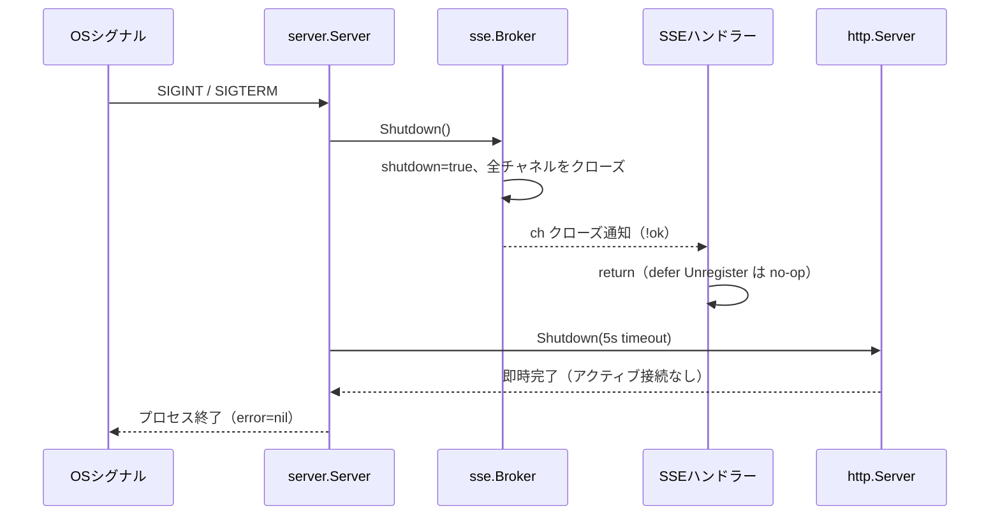
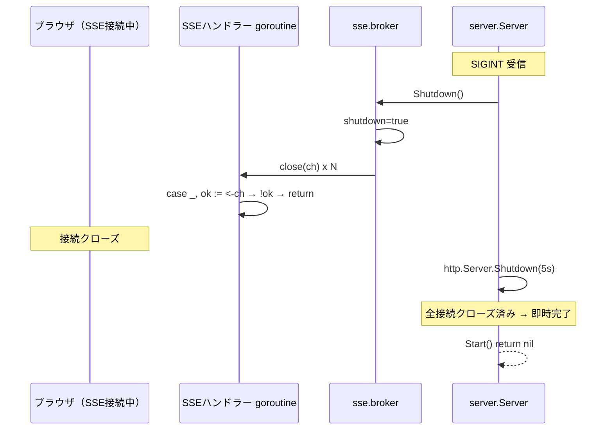
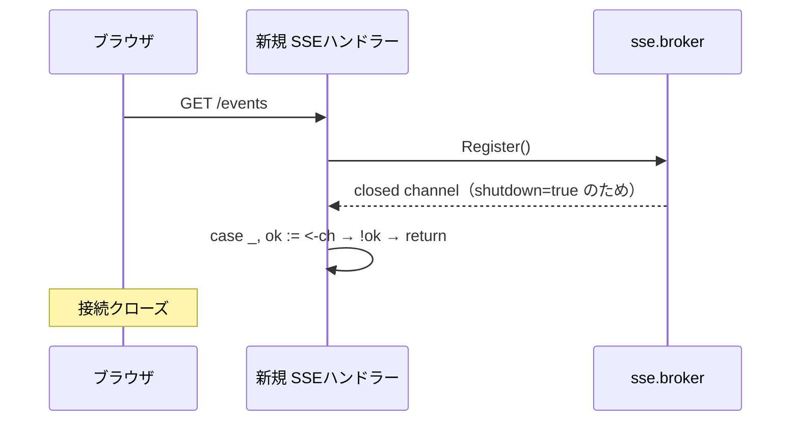

# Design Document: graceful-shutdown-with-sse

## Overview

本機能は、SSEクライアントが接続中であっても mdserve を確実にシャットダウンできるようにする。

**Purpose**: SIGINT/SIGTERM 受信時に、アクティブなSSE接続をサーバー側から明示的にクローズし、プロセスをクリーンに終了する。

**Users**: mdserve を開発用プレビューサーバーとして使用する開発者。Ctrl+C で即座に終了できることが期待される。

**Impact**: 現在は SSE 接続が存在すると `http.Server.Shutdown()` が最長5秒待機し `context.DeadlineExceeded` エラーで終了するが、修正後は SSE 接続を先にクローズするためクリーンに即時終了する。

### Goals

- SIGINT/SIGTERM 受信時に全 SSE 接続をサーバー側から明示的にクローズする
- SSE 接続クローズ後に `http.Server.Shutdown()` を呼び出し、クリーンな終了を保証する
- 変更範囲を最小限に抑える（`internal/sse` と `internal/server` パッケージのみ）

### Non-Goals

- SSE 以外の長時間接続（WebSocket 等）への対応（本システムは SSE のみ使用）
- シャットダウンタイムアウト値のCLIフラグによる設定変更
- ブラウザ側への「サーバーシャットダウン中」の通知イベント送信

---

## Architecture

### Existing Architecture Analysis

現在の `Server.Shutdown()` のシーケンス:
1. `s.watcher.Close()` — ファイル監視停止
2. `s.httpSrv.Shutdown(5s timeout)` — HTTP サーバー停止（SSE 接続のクローズを待機）

**問題**: `http.Server.Shutdown()` はアクティブな HTTP 接続（SSE を含む）が idle になるまで待機する。SSE ハンドラーの `r.Context()` は `Shutdown()` 呼び出しによって自動キャンセルされないため、ハンドラーが終了せずタイムアウトまで待機が続く。詳細な調査結果は `research.md` を参照。

**修正**: `s.httpSrv.Shutdown()` の前に `s.broker.Shutdown()` を呼び出す。`broker.Shutdown()` は全クライアントチャネルをクローズし、各 SSE ハンドラーが `case _, ok := <-ch: if !ok { return }` で自律的に終了する。

### Architecture Pattern & Boundary Map



**アーキテクチャ統合**:
- 選択パターン: 既存の `Broker` インターフェースへの `Shutdown()` メソッド追加
- ドメイン境界: `sse` パッケージが SSE 接続のライフサイクルを完全に管理（変更なし）
- 保持されるパターン: ハンドラーは構造体で実装、依存をコンストラクタで注入
- ステアリング準拠: インターフェースは動詞 + メソッドパターン、依存は上位→下位の一方向

### Technology Stack

| Layer | Choice / Version | Role in Feature | Notes |
|-------|-----------------|-----------------|-------|
| Backend / Services | Go 1.24 標準ライブラリ | シグナル処理、HTTP シャットダウン | 新規外部依存なし |
| Messaging / Events | `internal/sse` | SSE チャネル管理 | `Broker` インターフェースに `Shutdown()` を追加 |

---

## System Flows

シャットダウンシーケンス（SSE 接続あり）:



シャットダウン後の新規 SSE 接続試行:



---

## Requirements Traceability

| Requirement | Summary | Components | Interfaces | Flows |
|-------------|---------|------------|------------|-------|
| 1.1 | SIGINT/SIGTERM でシャットダウン開始 | `server.Server` | `Server.Shutdown()` | シャットダウンシーケンス |
| 1.2 | 起動時からシグナルをリッスン | `server.Server` | `Server.Start()` | — （既存実装で対応済み） |
| 2.1 | シャットダウン時に全 SSE 接続をクローズ | `sse.broker` | `Broker.Shutdown()` | シャットダウンシーケンス |
| 2.2 | シャットダウン後の新規接続を拒否 | `sse.broker` | `Broker.Register()` | 新規接続試行フロー |
| 2.3 | 全接続クローズ完了まで次ステップに進まない | `server.Server` | `Server.Shutdown()` | シャットダウンシーケンス |
| 3.1 | SSE クローズ後に HTTP サーバーをシャットダウン | `server.Server` | `Server.Shutdown()` | シャットダウンシーケンス |
| 3.2 | シャットダウン完了後にプロセス終了 | `server.Server` | `Server.Start()` | シャットダウンシーケンス |
| 4.1 | 5秒タイムアウトで強制終了 | `server.Server` | `Server.Shutdown()` | — （既存実装で対応、安全網として維持） |
| 4.2 | タイムアウト時にログ出力 | `server.Server` | `Server.Start()` | — |

---

## Components and Interfaces

### コンポーネントサマリー

| Component | Domain/Layer | Intent | Req Coverage | Key Dependencies | Contracts |
|-----------|-------------|--------|-------------|-----------------|-----------|
| `sse.Broker`（拡張） | Messaging | SSE チャネルのライフサイクル管理 | 2.1, 2.2, 2.3 | なし | Service |
| `server.Server.Shutdown()`（修正） | Services | グレースフルシャットダウン調整 | 1.1, 2.1, 3.1, 3.2, 4.1 | `sse.Broker`, `watcher.Watcher`, `http.Server` | Service |

---

### sse パッケージ

#### Broker インターフェース（拡張）

| Field | Detail |
|-------|--------|
| Intent | SSE クライアントチャネルの登録・ブロードキャスト・クローズを管理する |
| Requirements | 2.1, 2.2, 2.3 |

**Responsibilities & Constraints**
- 全クライアントチャネルの生成・管理・ブロードキャスト・クローズを一元管理する
- `Shutdown()` 呼び出し後は `Register()` で新規チャネルを登録してはならない
- `sync.Mutex` で全操作を保護し、並行アクセスに対して安全であること

**Dependencies**
- Inbound: `server.Server` — ライフサイクル管理 (P0)
- Inbound: SSE ハンドラー goroutine — チャネルの登録・解除 (P0)
- Outbound: なし

**Contracts**: Service [x] / API [ ] / Event [ ] / Batch [ ] / State [x]

##### Service Interface（Go）

```go
// Broker manages SSE client channels.
type Broker interface {
    // Register creates and registers a new client channel.
    // If Shutdown has been called, returns an already-closed channel.
    Register() <-chan struct{}

    // Unregister removes the client channel from the broker and closes it.
    // No-op if the channel was already removed by Shutdown.
    Unregister(ch <-chan struct{})

    // Broadcast sends a reload signal to all registered clients (non-blocking).
    Broadcast()

    // Shutdown closes all registered client channels and prevents new registrations.
    // Calling Shutdown multiple times is safe (idempotent not required, but safe).
    Shutdown()
}
```

- Preconditions: なし（いつでも呼び出し可能）
- Postconditions: `Shutdown()` 後、`Register()` は closed channel を返す。全既存クライアントチャネルはクローズ済み
- Invariants: `sync.Mutex` によりすべての操作が並行安全

##### State Management

- State model: `shutdown bool` フラグ（false → true の一方向遷移のみ）
- Persistence: なし（プロセス内メモリのみ）
- Concurrency strategy: `sync.Mutex` による全操作の排他制御

**Implementation Notes**
- `Shutdown()` はマップの全チャネルをクローズした後マップをクリアする。後続の `Unregister()` 呼び出しはマップが空のため no-op となり、二重クローズによるパニックは発生しない
- `Register()` が `shutdown == true` の際に返す closed channel は make → close で生成する（SSE ハンドラーが `!ok` で即時終了できるように）

---

### server パッケージ

#### Server.Shutdown()（修正）

| Field | Detail |
|-------|--------|
| Intent | ウォッチャー・SSE ブローカー・HTTP サーバーを順序立てて停止する |
| Requirements | 1.1, 2.1, 3.1, 3.2, 4.1, 4.2 |

**Responsibilities & Constraints**
- シャットダウン手順の正しい順序を保証する: watcher → broker → httpSrv
- `broker.Shutdown()` は `http.Server.Shutdown()` より先に呼ばなければならない
- 既存の 5 秒タイムアウトは SSE クローズ失敗時の安全網として維持する

**Dependencies**
- Inbound: OS シグナル（`Start()` の signal handler） (P0)
- Outbound: `watcher.Watcher.Close()` (P1)
- Outbound: `sse.Broker.Shutdown()` (P0)（新規追加）
- Outbound: `http.Server.Shutdown()` (P0)

**Contracts**: Service [x]

##### Service Interface（Go）

```go
// Shutdown gracefully stops the HTTP server.
// Sequence: watcher.Close → broker.Shutdown → http.Server.Shutdown(5s)
func (s *Server) Shutdown() error
```

- Preconditions: `Start()` が呼ばれているか、呼ばれていない（後者は no-op）
- Postconditions: 全 SSE 接続がクローズされ、HTTP サーバーが停止している
- Invariants: 複数回呼び出しても安全（`httpSrv == nil` チェックあり）

**Implementation Notes**
- `broker.Shutdown()` 後、SSE ハンドラーが goroutine として非同期に終了する。`http.Server.Shutdown()` はその完了を待機する
- タイムアウト（`context.DeadlineExceeded`）が発生した場合、`Start()` はそのエラーを返す。`main()` は `os.Stderr` に出力して終了する（要件4.2）

---

## Error Handling

### Error Strategy

- **正常終了**: `broker.Shutdown()` → `http.Server.Shutdown()` が `nil` を返す → `Start()` が `nil` を返す
- **タイムアウト**: `http.Server.Shutdown()` が `context.DeadlineExceeded` を返す → `Start()` がエラーを返す → `main()` が `os.Stderr` に出力して `os.Exit(1)`（要件4.1, 4.2）
- **ウォッチャークローズエラー**: 無視（`_ = s.watcher.Close()`）。既存の動作を維持

### Monitoring

- タイムアウト発生時: `main()` の `fmt.Fprintf(os.Stderr, "error: %v\n", err)` で出力済み（既存実装）
- 追加ロギング不要

---

## Testing Strategy

### Unit Tests（`internal/sse`）

1. `TestBroker_ShutdownClosesAllChannels` — `Shutdown()` 後に全チャネルが closed になること（`!ok` を確認）
2. `TestBroker_ShutdownPreventsNewRegistrations` — `Shutdown()` 後の `Register()` が closed channel を返すこと
3. `TestBroker_UnregisterAfterShutdownIsNoop` — `Shutdown()` 後の `Unregister()` がパニックしないこと
4. `TestBroker_ShutdownWithNoClients` — クライアントなしで `Shutdown()` を呼んでもパニックしないこと

### Integration Tests（`internal/server`）

5. `TestServer_ShutdownWithActiveSSEConnection` — SSE 接続が確立した状態で `Shutdown()` を呼んだとき、タイムアウトなしで終了すること（`context.DeadlineExceeded` が返らないこと）
6. `TestServer_ShutdownClosesSSEHandlerGoroutine` — シャットダウン後に SSE ハンドラーの goroutine がリークしないこと

### Existing Tests（変更なし）

- `TestServer_ShutdownGracefully` — SSE 接続なしのシャットダウン（既存テスト、引き続き pass すること）
- `TestBroker_*` — 既存の Broadcast/Register/Unregister テスト（新しいインターフェースでも pass すること）
