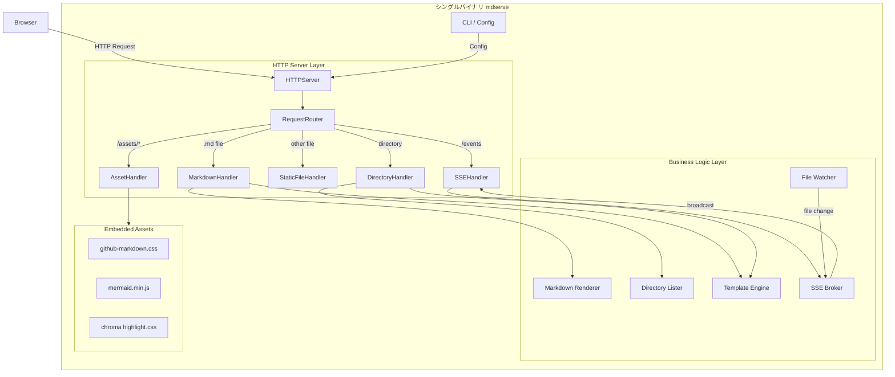
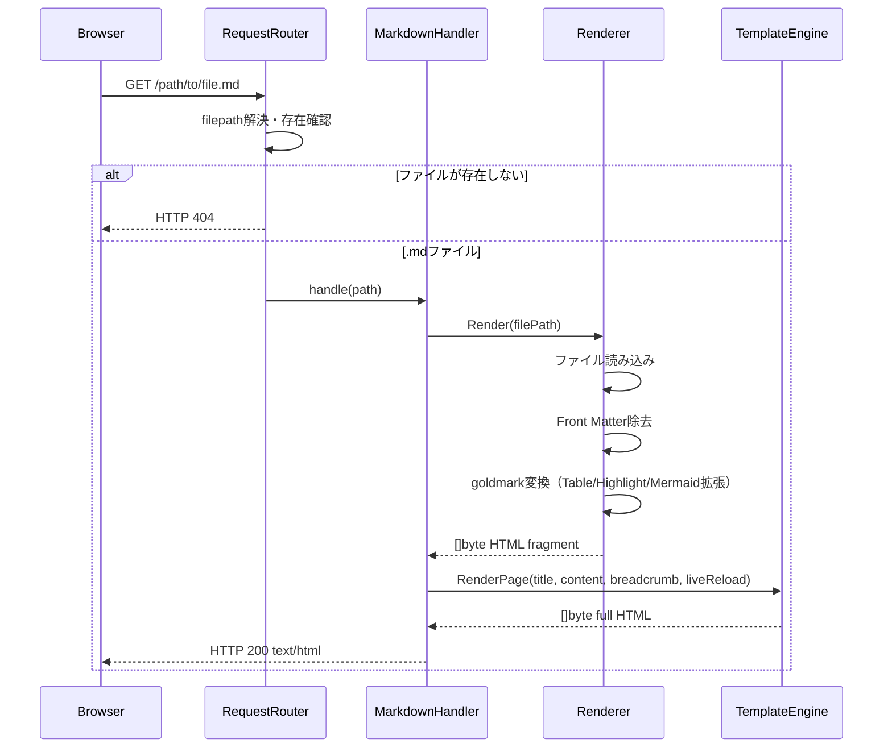
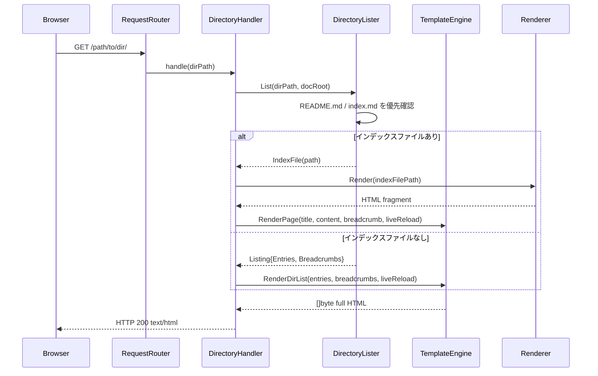
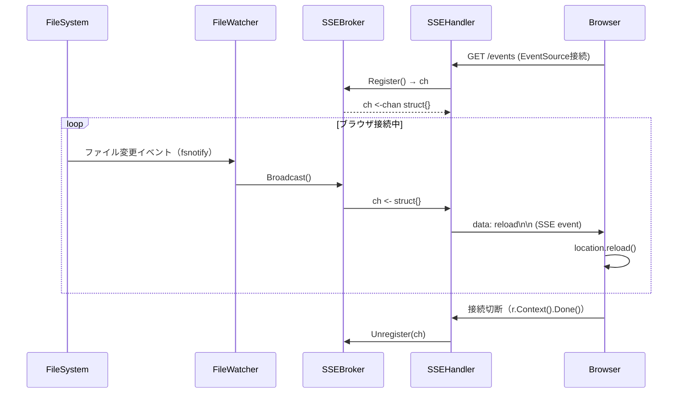

# 技術設計書: Markdown HTML Server

---

## Overview

本機能は、Markdownファイルを格納したディレクトリをブラウザで閲覧可能なウェブサイトとして即座に公開するローカルHTTPサーバーツール「Markdown HTML Server」を実現する。Mermaid.jsによる図表レンダリング、シンタックスハイライト、ライブリロードをサポートし、シングルバイナリとして配布・実行できる。

**Purpose**: ドキュメント作成者・閲覧者が、Markdownファイルをブラウザで読みやすいHTML形式で確認できる環境を、インストール作業なしに即座に構築できる手段を提供する。

**Users**: ドキュメント作成者（ライブプレビューで執筆フロー改善）、ドキュメント閲覧者（Markdownシンタックスを意識せずに閲覧）、インフラ担当者（シングルバイナリで環境依存なく配備）が対象。

**Impact**: 新規ツールとして既存システムへの変更はなし。スタンドアロンのローカルサーバープロセスとして動作する。

### Goals

- Markdownファイルを即座にHTMLとしてブラウザで閲覧できる
- Mermaid.jsの図表をCDN依存なしでレンダリングする
- `mdserve [dir]` の単一コマンドで起動できるシングルバイナリを提供する
- ファイル変更を検知してブラウザを自動リロードし、ライブプレビューを実現する

### Non-Goals

- マルチユーザー・認証・公開向けHTTPサーバー機能（ローカル用途に特化）
- Markdownのインタラクティブ編集・CMS機能
- PDF・EPUBなどのMarkdown以外フォーマットへの変換
- Mermaidのサーバーサイドレンダリング（バイナリ依存を避けるため）
- プラグインシステム・カスタムテーマ

---

## Requirements Traceability

| 要件 | 概要 | 担当コンポーネント | インターフェース | フロー |
|------|------|-------------------|----------------|-------|
| 1.1 | .mdファイルのHTMLレスポンス | RequestRouter, MarkdownHandler | `RequestHandler` | MD Request Flow |
| 1.2 | 標準Markdownシンタックスのレンダリング | Renderer | `Renderer.Render` | MD Request Flow |
| 1.3 | シンタックスハイライト | Renderer（Chroma統合） | `Renderer.Render` | MD Request Flow |
| 1.4 | YAML Front Matter除去 | Renderer（frontmatter拡張） | `Renderer.Render` | MD Request Flow |
| 1.5 | スタイルシート適用 | TemplateEngine, 埋め込みアセット | `TemplateEngine.RenderPage` | MD Request Flow |
| 2.1 | Mermaidコードブロックのレンダリング | Renderer（Mermaid拡張） | `Renderer.Render` | MD Request Flow |
| 2.2 | 複数種類の図表サポート | Renderer（mermaid.min.js v11） | — | — |
| 2.3 | Mermaid構文エラー時の表示継続 | Renderer（クライアントサイド） | — | — |
| 2.4 | Mermaid.jsのローカル配信 | AssetHandler（埋め込みアセット） | HTTP `GET /assets/*` | — |
| 3.1 | 指定ディレクトリのHTTPサーバー起動 | Server | `Server.Start` | — |
| 3.2 | デフォルトポート3333・起動アドレス表示 | Server | `Server.Start` | — |
| 3.3 | --portオプションでポート指定 | CLI | `Config` | — |
| 3.4 | .mdはHTML変換、その他はパススルー | RequestRouter | `RequestHandler` | MD / Static Flow |
| 3.5 | 存在しないファイルへのHTTP 404 | RequestRouter | `RequestHandler` | — |
| 3.6 | SIGINT/SIGTERMによる正常シャットダウン | Server | `Server.Shutdown` | — |
| 4.1 | ディレクトリアクセス時のファイル一覧表示 | DirectoryHandler | `DirectoryLister.List` | Dir Request Flow |
| 4.2 | ファイルリストの各ファイルへのリンク | DirectoryHandler, TemplateEngine | `TemplateEngine.RenderDirList` | Dir Request Flow |
| 4.3 | README.md / index.md の優先表示 | DirectoryHandler | `DirectoryLister.List` | Dir Request Flow |
| 4.4 | パンくずリストの表示 | TemplateEngine | `TemplateEngine.RenderPage` | — |
| 4.5 | 非.mdファイルをディレクトリ一覧から除外 | DirectoryHandler | `DirectoryLister.List` | — |
| 5.1 | シングルバイナリとしてビルド | ビルドプロセス（`go build`） | — | — |
| 5.2 | `mdserve [dir]` の形式でディレクトリ引数受け取り | CLI | `Config` | — |
| 5.3 | 引数省略時はカレントディレクトリを使用 | CLI | `Config` | — |
| 5.4 | --portオプション | CLI | `Config` | — |
| 5.5 | --helpオプション | CLI | — | — |
| 5.6 | 存在しないディレクトリ指定時のエラー表示と起動中止 | CLI | `Config` | — |
| 6.1 | .mdファイルの変更・追加・削除を監視 | FileWatcher | `Watcher.Watch` | Live Reload Flow |
| 6.2 | ファイル変更時のブラウザ自動リロード | SSEBroker, SSEHandler | `Broker.Broadcast` | Live Reload Flow |
| 6.3 | ライブリロードスクリプトのHTML自動埋め込み | TemplateEngine | `TemplateEngine.RenderPage` | — |
| 6.4 | --no-watchオプションでファイル監視無効化 | CLI, Server | `Config.NoWatch` | — |

---

## Architecture

### Architecture Pattern & Boundary Map

採用パターン: **レイヤードアーキテクチャ**（CLI → Server → Business Logic）

シングルバイナリのCLIツールとして、シンプルで保守しやすいレイヤー分離を採用する。HTTPルーティング・Markdownレンダリング・ファイル監視を独立したコンポーネントとして実装し、インターフェースを通じて結合する。



### Technology Stack

| レイヤー | 選定技術 / バージョン | 役割 | 備考 |
|---------|---------------------|------|------|
| Language / Runtime | Go 1.22+ | シングルバイナリコンパイル、標準HTTPサーバー | `go build` で依存なし実行ファイル生成 |
| Markdown Parser | goldmark（最新安定版） | Markdown→HTML変換（CommonMark準拠） | Hugo採用実績、拡張エコシステムが豊富 |
| Front Matter | go.abhg.dev/goldmark/frontmatter v0.3.0+ | YAML Front Matter除去 | YAML/TOML両対応 |
| Syntax Highlight | goldmark-highlighting/v2 + Chroma v2.23.1 | コードブロックのシンタックスハイライト | 250言語対応、GitHubスタイル |
| Mermaid | mermaid.min.js v11.12.3（`//go:embed`） | ダイアグラムのクライアントサイドレンダリング | ローカル配信でCDN非依存 |
| File Watch | fsnotify v1.9.0 | ファイル変更検知 | 再帰監視は内部実装で対応 |
| Live Reload | net/http + http.Flusher（stdlib） | SSEによるブラウザ自動リロード | 外部依存なし |
| HTML Template | html/template（stdlib） | HTMLページ生成 | XSSエスケープ標準対応 |
| Asset Embedding | embed（stdlib, Go 1.16+） | CSS/JSのバイナリ内包 | `//go:embed assets/` |
| CSS | github-markdown-css v5.9.0（`//go:embed`） | Markdown HTMLスタイル | MIT, ~15KB |
| CLI | flag（stdlib） | コマンドライン引数パース | 外部依存なし |

詳細な技術選定根拠・比較は `research.md` の「Architecture Pattern Evaluation」「Design Decisions」を参照。

---

## System Flows

### Markdown Request Flow



### Directory Request Flow



### Live Reload Flow



---

## Components and Interfaces

### コンポーネント概要

| コンポーネント | 層 | 責務 | 要件カバレッジ | 主要依存（優先度） | コントラクト |
|--------------|------|------|--------------|-------------------|-------------|
| CLI | CLI | 引数パース・Config生成・起動 | 5.2, 5.3, 5.4, 5.5, 5.6, 3.3, 6.4 | Server (P0) | Service |
| Server | HTTP Server | HTTPサーバー起動・ルーティング・シャットダウン | 3.1, 3.2, 3.6 | Router (P0), FileWatcher (P1), SSEBroker (P1) | Service |
| RequestRouter | HTTP Server | URLパスを解決し適切なHandlerへ委譲 | 1.1, 3.4, 3.5 | MarkdownHandler (P0), DirectoryHandler (P0), StaticFileHandler (P1), AssetHandler (P1), SSEHandler (P1) | Service |
| MarkdownHandler | HTTP Server | .mdリクエストを処理しHTMLレスポンス生成 | 1.1 | Renderer (P0), TemplateEngine (P0) | Service |
| DirectoryHandler | HTTP Server | ディレクトリリクエストを処理 | 4.1, 4.2, 4.3 | DirectoryLister (P0), TemplateEngine (P0), Renderer (P1) | Service |
| StaticFileHandler | HTTP Server | 非.mdファイルのパススルー配信 | 3.4 | `http.FileServer`（stdlib） | Service |
| AssetHandler | HTTP Server | 埋め込みアセット（CSS/JS）の配信 | 2.4, 1.5 | 埋め込みアセット（P0） | Service, API |
| SSEHandler | HTTP Server | SSE接続管理・リロードイベント送信 | 6.2 | SSEBroker (P0) | Service, API |
| Renderer | Business Logic | Markdown→HTML変換パイプライン | 1.2, 1.3, 1.4, 2.1, 2.2, 2.3 | goldmark (P0), frontmatter拡張 (P0), Chroma (P0), Mermaid拡張 (P0) | Service |
| DirectoryLister | Business Logic | ディレクトリ内容の列挙・インデックスファイル検出 | 4.1, 4.3, 4.5 | `os`, `path/filepath`（stdlib） | Service |
| TemplateEngine | Business Logic | HTMLページ全体の生成 | 1.5, 4.2, 4.4, 6.3 | 埋め込みHTMLテンプレート (P0) | Service |
| SSEBroker | Business Logic | SSEクライアント登録・ブロードキャスト | 6.2 | — | Service, State |
| FileWatcher | Business Logic | fsnotifyを用いたファイル変更監視 | 6.1, 6.2 | fsnotify v1.9.0 (P0), SSEBroker (P0) | Service |

---

### CLI / Config Layer

#### CLI

| フィールド | 詳細 |
|-----------|------|
| Intent | コマンドライン引数を解析し `Config` を生成してサーバーを起動する |
| Requirements | 5.2, 5.3, 5.4, 5.5, 5.6, 3.3, 6.4 |

**Responsibilities & Constraints**
- `flag` パッケージ（stdlib）でコマンドライン引数を解析する
- `--port`・`--no-watch`・`--help` フラグおよびディレクトリパス位置引数を処理する
- ディレクトリパスが指定されない場合は `os.Getwd()` でカレントディレクトリを使用する
- 指定ディレクトリの存在確認（`os.Stat`）を行い、存在しない場合はエラーメッセージを出力して `os.Exit(1)` する
- 生成した `Config` を `Server` に渡して起動する

**Dependencies**
- Outbound: Server — Config渡し・起動 (P0)
- External: `flag`, `os`, `fmt`（stdlib） — 引数パース・ファイル存在確認 (P0)

**Contracts**: Service [x]

##### Service Interface

```go
// Config はアプリケーション設定を保持するバリューオブジェクト
type Config struct {
    DocRoot string // サーブするディレクトリの絶対パス
    Port    int    // リッスンポート番号（デフォルト: 3333）
    NoWatch bool   // true の場合はファイル監視・ライブリロードを無効化
}
```

- Preconditions: `DocRoot` が絶対パスの存在するディレクトリであること
- Postconditions: `Config` の各フィールドにCLI引数・デフォルト値が正しく設定されていること
- Invariants: `Port` は 1-65535 の範囲内

**Implementation Notes**
- Integration: `main()` 関数内で `flag.Parse()` を呼び出し、`Config` を構築して `server.New(config).Start()` を実行する
- Validation: `os.Stat(config.DocRoot)` でディレクトリ存在確認。`os.IsNotExist(err)` の場合 `fmt.Fprintf(os.Stderr, ...)` でエラー出力
- Risks: パスのシンボリックリンク解決（`filepath.EvalSymlinks`）を行うことでパストラバーサルリスクを低減する

---

### HTTP Server Layer

#### Server

| フィールド | 詳細 |
|-----------|------|
| Intent | HTTPサーバーの起動・ルート登録・シグナルハンドリングによるグレースフルシャットダウンを管理する |
| Requirements | 3.1, 3.2, 3.6 |

**Responsibilities & Constraints**
- `net/http` の `http.Server` を構成し、指定ポートでリッスンを開始する
- 起動アドレス（例: `Serving /path/to/dir on http://localhost:3333`）をコンソールに出力する
- `RequestRouter`・`AssetHandler`・`SSEHandler` をルートに登録する
- `os/signal` で `SIGINT`・`SIGTERM` を捕捉し、`http.Server.Shutdown()` を呼んでグレースフルシャットダウンする
- `Config.NoWatch == false` の場合は `FileWatcher` を起動する

**Dependencies**
- Outbound: RequestRouter — HTTPルーティング委譲 (P0)
- Outbound: FileWatcher — ファイル監視起動 (P1)
- Outbound: SSEBroker — FileWatcher経由でブロードキャスト (P1)
- External: `net/http`, `os/signal`, `context`（stdlib） — HTTPサーバー・シグナル処理 (P0)

**Contracts**: Service [x]

##### Service Interface

```go
type Server struct {
    config  Config
    watcher Watcher
    broker  Broker
}

func New(cfg Config) *Server
func (s *Server) Start() error   // リッスン開始。SIGINTまでブロック
func (s *Server) Shutdown() error // グレースフルシャットダウン
```

- Preconditions: `cfg.DocRoot` が有効なディレクトリパス
- Postconditions: `Start()` は SIGINT/SIGTERM 受信後に全接続がクローズされてから返る
- Invariants: `Shutdown()` 呼び出し後は新規リクエストを受け付けない

**Implementation Notes**
- Integration: `http.ServeMux` でルートを登録。`/events` → SSEHandler、`/assets/` → AssetHandler、それ以外 → RequestRouter
- Risks: シャットダウンタイムアウトを設定（デフォルト5秒）し、長時間SSE接続がある場合も強制終了できるようにする

---

#### RequestRouter

| フィールド | 詳細 |
|-----------|------|
| Intent | リクエストパスを解決し、適切なハンドラーに委譲する |
| Requirements | 1.1, 3.4, 3.5 |

**Responsibilities & Constraints**
- URLパスを `filepath.Join(docRoot, urlPath)` で実ファイルパスに変換する
- `filepath.Clean` と `docRoot` 前方一致チェックでパストラバーサルを防止する
- `os.Stat` でファイル存在確認。不存在の場合は `http.NotFound` を返す
- ファイル種別により委譲先を決定:
  - `.md` 拡張子 → `MarkdownHandler`
  - ディレクトリ → `DirectoryHandler`
  - その他 → `StaticFileHandler`（`http.FileServer`）

**Dependencies**
- Outbound: MarkdownHandler — .mdファイル処理 (P0)
- Outbound: DirectoryHandler — ディレクトリ処理 (P0)
- Outbound: StaticFileHandler — 非.mdファイル配信 (P1)
- External: `os`, `path/filepath`, `net/http`（stdlib） (P0)

**Contracts**: Service [x]

##### Service Interface

```go
type RequestHandler interface {
    ServeHTTP(w http.ResponseWriter, r *http.Request)
}

func NewRequestRouter(
    docRoot      string,
    mdHandler    RequestHandler,
    dirHandler   RequestHandler,
    staticHandler RequestHandler,
) RequestHandler
```

- Preconditions: `docRoot` が絶対パスの存在するディレクトリ
- Postconditions: 存在しないパスは必ず 404 を返す。存在するパスは適切なハンドラーに委譲される

**Implementation Notes**
- Validation: `strings.HasPrefix(resolvedPath, docRoot)` でディレクトリトラバーサルを防止する
- Risks: シンボリックリンク経由の脱出対策として `filepath.EvalSymlinks` を適用する

---

#### AssetHandler

| フィールド | 詳細 |
|-----------|------|
| Intent | `//go:embed` で埋め込んだ静的アセット（CSS・JS）を `/assets/` パスで配信する |
| Requirements | 2.4, 1.5 |

**Contracts**: Service [x] / API [x]

##### API Contract

| Method | Endpoint | Response | Notes |
|--------|----------|----------|-------|
| GET | /assets/mermaid.min.js | mermaid.min.js (application/javascript) | mermaid v11.12.3 埋め込み |
| GET | /assets/github-markdown.css | github-markdown.css (text/css) | v5.9.0 埋め込み |
| GET | /assets/highlight.css | Chroma CSS (text/css) | GitHubスタイル生成 |

**Implementation Notes**
- Integration: `http.FileServer(http.FS(assetsFS))` で `embed.FS` をサーブする

---

#### SSEHandler

| フィールド | 詳細 |
|-----------|------|
| Intent | SSEエンドポイントを公開し、SSEBrokerから受信したリロードイベントをブラウザに送信する |
| Requirements | 6.2 |

**Contracts**: Service [x] / API [x]

##### API Contract

| Method | Endpoint | Response | Notes |
|--------|----------|----------|-------|
| GET | /events | text/event-stream | SSE接続。接続中はキープアライブ。リロードイベントで `data: reload\n\n` を送信 |

##### Service Interface

```go
func NewSSEHandler(broker Broker) http.HandlerFunc
```

**Implementation Notes**
- Integration: `w.Header().Set("Content-Type", "text/event-stream")` 設定後、`broker.Register()` でチャンネルを取得。`r.Context().Done()` で接続切断を検知し `broker.Unregister(ch)` を呼ぶ
- Validation: `w.(http.Flusher)` のキャスト失敗時は 500 を返してSSE不サポートを通知する

---

### Business Logic Layer

#### Renderer

| フィールド | 詳細 |
|-----------|------|
| Intent | MarkdownファイルをHTMLフラグメントに変換するパイプラインを提供する |
| Requirements | 1.2, 1.3, 1.4, 2.1, 2.2, 2.3 |

**Responsibilities & Constraints**
- goldmark に以下の拡張を組み込んだ変換パイプラインを構成する:
  - `extension.Table`, `extension.Strikethrough`, `extension.TaskList`（標準拡張）
  - `frontmatter.Extender`（YAML Front Matter 除去）
  - `highlighting.NewHighlighting(highlighting.WithStyle("github"))`（Chroma v2）
  - Mermaidコードブロックを `<div class="mermaid">` タグに変換するカスタム拡張
- `Render` はHTMLフラグメント（`<article>` 内容）のみを返し、ページ全体のラップは `TemplateEngine` が担う

**Dependencies**
- External: `github.com/yuin/goldmark` — Markdown→HTML変換コア (P0)
- External: `go.abhg.dev/goldmark/frontmatter` v0.3.0+ — Front Matter除去 (P0)
- External: `github.com/yuin/goldmark-highlighting/v2` + `github.com/alecthomas/chroma/v2` v2.23.1 — シンタックスハイライト (P0)
- External: Mermaidカスタムgoldmark拡張 — mermaidコードブロック変換 (P0)

**Contracts**: Service [x]

##### Service Interface

```go
type Renderer interface {
    Render(filePath string) ([]byte, error)
}

type RenderError struct {
    FilePath string
    Cause    error
}

func (e *RenderError) Error() string
func (e *RenderError) Unwrap() error
```

- Preconditions: `filePath` が存在する読み取り可能な `.md` ファイル
- Postconditions: 返却される `[]byte` は有効なHTMLフラグメント（`<div>` / `<p>` などを含むがページ全体ではない）
- Invariants: Mermaidの構文エラーはページ全体のレンダリングを妨げない（エラーメッセージを図の代わりに表示）

**Implementation Notes**
- Integration: goldmarkの `goldmark.New(goldmark.WithExtensions(...))` でパーサーを一度だけ構築し、`Renderer` 実装の初期化時にキャッシュする（ゴルーチンセーフ）
- Validation: ファイルが存在しない・読み取り不可の場合は `*RenderError` を返す
- Risks: Mermaidカスタム拡張は goldmark-mermaid の `ScriptURL` 設定が利用可能であればそれを使用し、不可の場合は独自コードフェンスレンダラーで `<div class="mermaid">` を出力する

---

#### DirectoryLister

| フィールド | 詳細 |
|-----------|------|
| Intent | ディレクトリ内の .md ファイルとサブディレクトリを列挙し、インデックスファイルを検出する |
| Requirements | 4.1, 4.3, 4.5 |

**Contracts**: Service [x]

##### Service Interface

```go
type Entry struct {
    Name  string // 表示名（ファイル名）
    Path  string // docRootからの相対URLパス
    IsDir bool   // サブディレクトリの場合 true
}

type Breadcrumb struct {
    Label string // 表示ラベル
    URL   string // リンク先URL
}

type Listing struct {
    Title       string       // ページタイトル（ディレクトリ名）
    Breadcrumbs []Breadcrumb // ルートから現在ディレクトリまでのパンくず
    Entries     []Entry      // .mdファイルとサブディレクトリの一覧
    IndexFile   string       // README.md / index.md のパス（存在する場合）
}

type DirectoryLister interface {
    List(dirPath, docRoot string) (*Listing, error)
}
```

- Preconditions: `dirPath` が `docRoot` 以下の存在するディレクトリ
- Postconditions: `Listing.IndexFile` は `README.md` → `index.md` の順で最初に見つかったファイルのパス（なければ空文字列）。`Listing.Entries` には `.md` ファイルとサブディレクトリのみを含む（非.mdファイルは除外）
- Invariants: `Breadcrumbs` の最初の要素は常にドキュメントルート（`/`）

**Implementation Notes**
- Integration: `os.ReadDir` でディレクトリエントリを列挙。ファイル名 `README.md`・`index.md`（大文字小文字を問わず）の順で確認する
- Validation: `dirPath` が `docRoot` の外を指す場合は `ErrForbidden` を返す

---

#### TemplateEngine

| フィールド | 詳細 |
|-----------|------|
| Intent | Markdownページ・ディレクトリ一覧ページのHTML全体を生成する |
| Requirements | 1.5, 4.2, 4.4, 6.3 |

**Responsibilities & Constraints**
- `html/template`（stdlib）で埋め込みHTMLテンプレートを用いてページ全体を生成する
- `liveReload == true` の場合、SSEクライアントスクリプト（`/events` へのEventSource接続）をHTML末尾に埋め込む
- `github-markdown.css`・`highlight.css` を `<link rel="stylesheet">` で参照する（`/assets/` から配信）
- Mermaid初期化スクリプト（`/assets/mermaid.min.js` 読み込み + `mermaid.initialize()`）を埋め込む

**Dependencies**
- External: `html/template`（stdlib） — テンプレートレンダリング (P0)

**Contracts**: Service [x]

##### Service Interface

```go
type PageData struct {
    Title       string
    Content     template.HTML // レンダラーが生成したHTMLフラグメント（XSSエスケープ不要）
    Breadcrumbs []Breadcrumb
    LiveReload  bool
}

type DirListData struct {
    Title       string
    Breadcrumbs []Breadcrumb
    Entries     []Entry
    LiveReload  bool
}

type TemplateEngine interface {
    RenderPage(data PageData) ([]byte, error)
    RenderDirList(data DirListData) ([]byte, error)
}
```

- Preconditions: `data.Content` はレンダラーが生成した信頼済みHTMLフラグメント
- Postconditions: 返却される `[]byte` は有効な完全なHTMLページ（`<!DOCTYPE html>` 〜 `</html>`）
- Invariants: `template.HTML` 型を使用して `Content` のエスケープを回避する（Renderer が信頼済みHTMLを生成することを前提とする）

**Implementation Notes**
- Integration: テンプレートファイルは `//go:embed templates/` でバイナリに埋め込む。`sync.Once` で起動時に一度だけパースする
- Risks: `template.HTML` のキャストは信頼済みソース（Renderer）からの出力にのみ適用すること

---

#### SSEBroker

| フィールド | 詳細 |
|-----------|------|
| Intent | SSEクライアントチャンネルの登録・解除・ブロードキャストを管理する |
| Requirements | 6.2 |

**Contracts**: Service [x] / State [x]

##### Service Interface

```go
type Broker interface {
    Register() <-chan struct{}      // 新規クライアントのチャンネルを生成・登録して返す
    Unregister(ch <-chan struct{})  // クライアントのチャンネルを登録解除する
    Broadcast()                    // 全登録クライアントにリロードイベントを送信する
}
```

##### State Management

- State model: `map[chan struct{}]struct{}` でアクティブクライアントを管理する
- Persistence & consistency: インメモリのみ（永続化なし）
- Concurrency strategy: `sync.Mutex` でマップへの並行アクセスを保護する。`Broadcast()` はブロッキングを防ぐために `select` + デフォルトケースでノンブロッキング送信を行う

**Implementation Notes**
- Integration: `FileWatcher` がファイル変更を検知した際に `Broker.Broadcast()` を呼び出す
- Risks: クライアント切断時に `Unregister` が呼ばれない場合のチャンネルリーク対策として、`Broadcast()` での送信失敗時にも `Unregister` を試みる

---

#### FileWatcher

| フィールド | 詳細 |
|-----------|------|
| Intent | fsnotifyを用いてドキュメントルート以下のファイル変更を監視し、SSEBrokerに通知する |
| Requirements | 6.1, 6.2 |

**Contracts**: Service [x]

##### Service Interface

```go
type Watcher interface {
    Watch(docRoot string) error // ファイル監視開始（バックグラウンドゴルーチンで動作）
    Close() error               // 監視停止・リソース解放
}
```

- Preconditions: `docRoot` が存在するディレクトリ
- Postconditions: `Watch()` 呼び出し後、`docRoot` 以下の `.md` ファイル変更時に `Broker.Broadcast()` が呼ばれる
- Invariants: `Close()` 後はイベントを発行しない

**Dependencies**
- External: `github.com/fsnotify/fsnotify` v1.9.0 — ファイルシステムイベント (P0)
- Outbound: SSEBroker — ファイル変更をブロードキャスト (P0)

**Implementation Notes**
- Integration: `filepath.WalkDir(docRoot, ...)` で全サブディレクトリを列挙し `watcher.Add()` で登録。`Create` イベントで新規ディレクトリが作成された場合は動的に追加登録する
- Validation: `Write`・`Create`・`Remove`・`Rename` イベントを対象とする。`Chmod` イベントは無視する
- Risks: 深いディレクトリ構造での起動時パフォーマンス低下。一般的なドキュメントリポジトリでは問題ないが、監視対象ディレクトリ数が1000を超える場合は起動警告を表示する

---

## Data Models

### Domain Model

本アプリケーションは永続ストレージを持たない。処理対象のデータモデルは以下の通り。

- **Config**: バリューオブジェクト（DocRoot, Port, NoWatch）— CLIからServerに渡す設定
- **Listing**: バリューオブジェクト（Title, Breadcrumbs, Entries, IndexFile）— DirectoryListerが返すディレクトリ内容
- **Entry**: バリューオブジェクト（Name, Path, IsDir）— ディレクトリ内のファイル・フォルダを表す
- **Breadcrumb**: バリューオブジェクト（Label, URL）— パンくずリストの1要素

### Logical Data Model

インメモリのみ。セッション情報として SSEBroker が `map[chan struct{}]struct{}` でアクティブなSSE接続を保持する。接続ごとに1つのバッファなしチャンネル（容量1）を割り当てる。サーバー終了時にすべてのチャンネルをクローズする。

### Data Contracts & Integration

**HTML レスポンス**
- Content-Type: `text/html; charset=utf-8`
- Markdown ページ: `<!DOCTYPE html>` + `github-markdown.css` + Chroma CSS + mermaid.min.js + コンテンツ + SSEスクリプト（--no-watchでない場合）
- ディレクトリ一覧: `<!DOCTYPE html>` + `github-markdown.css` + ファイルリンク一覧 + パンくずリスト

**SSE ストリーム**
- Content-Type: `text/event-stream`
- イベントフォーマット: `data: reload\n\n`
- キープアライブ: コメント行 `: keepalive\n\n` を15秒ごとに送信（プロキシ経由での接続維持）

---

## Error Handling

### Error Strategy

- 早期バリデーション: CLI起動時にディレクトリ存在確認を行い、不正な設定は起動前にエラー出力・終了する
- グレースフルデグラデーション: Mermaid構文エラーはページ全体のレンダリングを停止せず、エラーメッセージを図の代わりに表示する
- ユーザー向けアクションメッセージ: 404レスポンスにはシンプルなテキストのみ（デバッグ情報は含めない）

### Error Categories and Responses

**User Errors (4xx)**
- HTTP 404: 存在しないパスへのリクエスト → シンプルな404 HTMLレスポンス
- HTTP 403 (Forbidden): `docRoot` 外へのパストラバーサル → 403 HTMLレスポンス（パス情報は含めない）

**System Errors (5xx)**
- HTTP 500: ファイル読み取りエラー・テンプレート実行エラー → 500 HTMLレスポンス + サーバーコンソールへのエラーログ
- SSE 500: `http.Flusher` 非対応 → 500 + SSE非サポートメッセージ

**Business Logic Errors**
- Markdown 変換エラー: エラーログを出力し、エラー内容を示すHTMLフラグメントを生成してページレンダリングを継続する
- Mermaid 構文エラー: クライアントサイドで mermaid.js がエラー表示を担う（サーバー側での特別処理不要）

### Monitoring

- 標準エラー出力（`log` パッケージ）にサーバーイベント・エラーをログ出力する
- HTTPアクセスログは実装しない（シンプルなローカルツールのため）

---

## Testing Strategy

### Unit Tests

- `Renderer.Render`: 標準Markdown・Front Matter付き・Mermaidブロック付き・シンタックスハイライト付きの各ケース
- `DirectoryLister.List`: README.md優先・index.md優先・インデックスなし・非.mdファイル除外の各ケース
- `SSEBroker`: Register/Unregister/Broadcastの並行安全性テスト
- `RequestRouter`: .mdファイル・ディレクトリ・静的ファイル・存在しないパス・パストラバーサルの各ルーティング
- `TemplateEngine.RenderPage`: liveReload=true/falseでのSSEスクリプト埋め込み確認

### Integration Tests

- `Server.Start` + ブラウザHTTPリクエスト: 実際のHTTPサーバーを起動し、.mdファイル・ディレクトリ・404レスポンスをHTTPクライアントで検証する
- Mermaidエンドツーエンド: Mermaidコードブロックを含む.mdファイルのHTMLレスポンスに `<div class="mermaid">` が含まれることを検証する
- SSEライブリロード: ファイル変更後にSSEクライアントが `data: reload` イベントを受信することを検証する
- `--no-watch` オプション: ファイル変更後にSSEイベントが発行されないことを検証する

### Performance

- 大きなMarkdownファイル（1MB以上）のレンダリング応答時間（目標: 500ms以内）
- 多数のSSEクライアント接続時（100接続）のブロードキャスト遅延

---

## Security Considerations

- **パストラバーサル防止**: `filepath.Clean` + `docRoot` 前方一致チェック + `filepath.EvalSymlinks` でシンボリックリンク経由の脱出を防ぐ
- **XSSエスケープ**: `html/template` を使用することでディレクトリ名・ファイル名のXSS出力をエスケープする。Renderer出力は `template.HTML` として扱い、goldmarkが生成する信頼済みHTMLとして処理する
- **ローカルオンリー**: デフォルトでは `localhost` バインドのみを推奨するが、現バージョンでは0.0.0.0バインド（全インターフェース）を採用しローカルネットワークでの利用を許可する（ローカルツールの用途に合わせた判断）
- **ディレクトリ一覧の情報漏洩**: `.md` ファイルとサブディレクトリのみ一覧表示し、設定ファイル・隠しファイルなどは意図的に除外する

---

## Supporting References

- 詳細な技術選定根拠・比較・リスク分析は `.kiro/specs/markdown-html-server/research.md` を参照
- goldmark 拡張の組み合わせ確認: `go.abhg.dev/goldmark/frontmatter` と goldmark-highlighting の競合がないことを実装時に検証する
- mermaid.min.js のライセンス: MIT ライセンス（バイナリへの同梱が許可されている）
