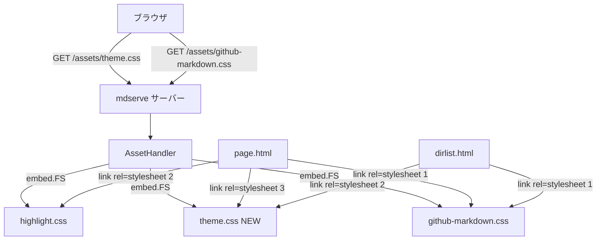

# 設計ドキュメント: UIデザイン改善

## 概要

本フィーチャーは、mdserve が生成するMarkdownページおよびディレクトリ一覧ページの視覚的デザインを改善する。現状の白黒・16pxのGitHubスタイルから、パステルピンク系のカラーテーマと拡大されたフォントサイズへ刷新し、読みやすくかわいい外観を実現する。

**対象ユーザー**: ローカルでmdserveを利用してMarkdownを閲覧するすべてのユーザー。
**変更の影響**: `page.html`（Markdownページ）と `dirlist.html`（ディレクトリ一覧）の両方に適用される。Go実装コードへの変更は不要。

### Goals

- 本文フォントサイズを16pxから18px以上に拡大して可読性を向上する
- パステルピンク系のカラーテーマを適用して「かわいい」外観を実現する
- ライトモード・ダークモード双方で統一されたテーマを適用する
- 両テンプレートのスタイル定義を単一ファイルに集約する

### Non-Goals

- `github-markdown.css`（vendored file）の変更
- Go実装コード（`internal/` パッケージ）の変更
- フォントファミリーの変更（既存のシステムフォントスタックを維持）
- Markdownレンダリングロジックの変更

## 要件トレーサビリティ

| 要件 | 概要 | コンポーネント | インターフェース | フロー |
|------|------|--------------|----------------|--------|
| 1.1 | 本文フォントサイズ18px以上 | ThemeCSS | CSSプロパティ上書き | — |
| 1.2 | 見出しの比例拡大 | ThemeCSS | フォントサイズ比率維持 | — |
| 1.3 | ディレクトリ一覧のフォント拡大 | ThemeCSS + DirlistTemplate | body font-size | — |
| 1.4 | 行間の適切な設定 | ThemeCSS | line-height上書き | — |
| 1.5 | コードブロックのフォント比率維持 | ThemeCSS | code font-size | — |
| 2.1 | パステル系背景色 | ThemeCSS | --bgColor-default上書き | — |
| 2.2 | 有彩色リンク | ThemeCSS | --fgColor-accent上書き | — |
| 2.3 | ホバーフィードバック | ThemeCSS | a:hover スタイル | — |
| 2.4 | 見出しカラーアクセント | ThemeCSS | h1-h3 スタイル | — |
| 2.5 | 両ページの統一テーマ | ThemeCSS + 両テンプレート | 共通CSS参照 | — |
| 2.6 | breadcrumbへのテーマ適用 | ThemeCSS | nav.breadcrumb スタイル | — |
| 3.1 | 共通スタイル定義の共有 | ThemeCSS | 単一CSSファイル | — |
| 3.2 | ナビリンクのスタイリング | ThemeCSS | .dir-list-link スタイル | — |
| 3.3 | github-markdown.css非変更 | ThemeCSS | CSSカスケード上書き | — |
| 3.4 | ダークモード対応 | ThemeCSS | @media prefers-color-scheme | — |

## アーキテクチャ

### 既存アーキテクチャの分析

- `github-markdown.css` は CSS カスタムプロパティ（`--bgColor-default` 等）を `@media (prefers-color-scheme)` ブロック内で定義しており、後から読み込まれるCSSで上書き可能
- `embed.go` の `//go:embed assets` ディレクティブにより `assets/` 配下の全ファイルが自動的にバイナリ埋め込みされる — 新CSSファイルの追加でGo変更不要
- `internal/server/server.go` が `/assets/` プレフィックスで `NewAssetHandler` を登録しており、新ファイルは即座に配信される
- 両テンプレートには共通のインラインスタイル（breadcrumb, body padding）が重複して存在する

### アーキテクチャパターンと境界

**アーキテクチャ上の判断**:
- 採用パターン: CSS カスケードオーバーライド（vendored CSS 変更なし）
- 境界: `github-markdown.css`（基盤スタイル） → `theme.css`（カスタマイズ層）
- `theme.css` は必ず `github-markdown.css` の後に配置してCSS変数を上書きする
- 詳細な判断根拠は `research.md` の「アーキテクチャパターン評価」を参照

### テクノロジースタック

| レイヤー | 選択 | 本フィーチャーでの役割 | 備考 |
|---------|------|----------------------|------|
| フロントエンド | CSS（カスタムプロパティ + メディアクエリ） | テーマのフォントサイズ・カラー定義 | 新規 `assets/theme.css` |
| テンプレート | Go `html/template` | `<link>` タグの追加 | 既存 `page.html`, `dirlist.html` 修正 |
| アセット配信 | Go `embed.FS` + `http.FileServer` | CSSファイルの自動配信 | 変更不要 |

## コンポーネントとインターフェース

### コンポーネントサマリー

| コンポーネント | レイヤー | 役割 | 要件カバレッジ | 主な依存 | コントラクト |
|--------------|--------|------|--------------|---------|------------|
| ThemeCSS | 静的アセット | テーマCSS定義 | 1.1〜3.4 全件 | github-markdown.css (P0) | State |
| PageTemplate | テンプレート | Markdownページ描画 | 1.1〜3.3 | ThemeCSS (P0) | — |
| DirlistTemplate | テンプレート | ディレクトリ一覧描画 | 1.3, 2.5, 3.1〜3.4 | ThemeCSS (P0) | — |

### 静的アセット層

#### ThemeCSS（`assets/theme.css`）

| フィールド | 詳細 |
|---------|------|
| Intent | `github-markdown.css` のCSS変数とベーススタイルをカスタムテーマで上書きする |
| 要件 | 1.1, 1.2, 1.3, 1.4, 1.5, 2.1, 2.2, 2.3, 2.4, 2.5, 2.6, 3.1, 3.2, 3.3, 3.4 |

**責務と制約**
- `.markdown-body` の `font-size` を `18px` に上書きする（`github-markdown.css` の `16px` を無効化）
- `line-height` を `1.7` に上書きして行間を広げる
- CSS カスタムプロパティ（`--bgColor-default`, `--fgColor-accent` 等）をライト・ダーク双方で上書きしてカラーテーマを適用する
- コードブロック（`code`, `pre`）のフォントサイズは本文比 `0.875em` を維持する
- `github-markdown.css` の変更は行わない（カスケード上書きのみ）

**依存**
- Inbound: `page.html`, `dirlist.html` — CSSとして読み込まれる（P0）
- Outbound: なし
- External: `github-markdown.css` — 上書き対象の変数を提供（P0）

**コントラクト**: State [x]

##### カラーパレット定義

**ライトモード**（`@media (prefers-color-scheme: light)`）:

| CSS変数 / プロパティ | 値 | 対応要件 |
|---------------------|-----|---------|
| `--bgColor-default` | `#fff5f7` | 2.1 |
| `--fgColor-accent` | `#d63384` | 2.2 |
| `--fgColor-default` | `#2d1b24` | — |
| h1-h3 border-bottom color | `#f3b8cc` | 2.4 |
| `nav.breadcrumb` color | `#9c4068` | 2.6 |
| `nav.breadcrumb a` color | `#d63384` | 2.6 |

**ダークモード**（`@media (prefers-color-scheme: dark)`）:

| CSS変数 / プロパティ | 値 | 対応要件 |
|---------------------|-----|---------|
| `--bgColor-default` | `#1e0d14` | 2.1, 3.4 |
| `--bgColor-muted` | `#2d1522` | 3.4 |
| `--fgColor-accent` | `#f48fb1` | 2.2, 3.4 |
| `--fgColor-default` | `#fde8ee` | 3.4 |
| `--borderColor-default` | `#5c2d45` | 3.4 |
| h1-h3 border-bottom color | `#5c2d45` | 2.4, 3.4 |
| `nav.breadcrumb` color | `#f3b8cc` | 2.6, 3.4 |

**タイポグラフィ定義**（モード共通）:

| プロパティ | 値 | 対応要件 |
|-----------|-----|---------|
| `.markdown-body` `font-size` | `18px` | 1.1 |
| `.markdown-body` `line-height` | `1.7` | 1.4 |
| `code`, `pre code` `font-size` | `0.875em` | 1.5 |

**実装ノート**
- Integration: `page.html` と `dirlist.html` に `<link rel="stylesheet" href="/assets/theme.css">` を追加。必ず `github-markdown.css` の後、`<body>` の前
- Validation: ライトモードの `#fff5f7` / `#d63384` の組み合わせはWCAG AA（4.5:1）を満たすことを設計時に確認
- Risks: `<link>` 順序ミスでスタイルが適用されない。テスト時に順序を確認すること

### テンプレート層

#### PageTemplate（`internal/tmpl/templates/page.html`）

| フィールド | 詳細 |
|---------|------|
| Intent | Markdownページに `theme.css` の参照を追加し、統一テーマを適用する |
| 要件 | 1.1, 1.2, 1.4, 1.5, 2.1〜2.6, 3.1, 3.2, 3.3, 3.4 |

**責務と制約**
- `<head>` に `<link rel="stylesheet" href="/assets/theme.css">` を `highlight.css` の後に追加する
- 既存のインラインスタイル（`body { ... }` の padding・max-width 等）は `theme.css` へ移管するか削除する
- Markdownコンテンツの描画ロジックは変更しない

**実装ノート**
- `<link>` の最終順序: `github-markdown.css` → `highlight.css` → `theme.css`
- インラインスタイルの `nav.breadcrumb` スタイルは `theme.css` 側に移管して削除する

#### DirlistTemplate（`internal/tmpl/templates/dirlist.html`）

| フィールド | 詳細 |
|---------|------|
| Intent | ディレクトリ一覧ページに `theme.css` の参照を追加し、統一テーマを適用する |
| 要件 | 1.3, 1.4, 2.5, 3.1, 3.2, 3.3, 3.4 |

**責務と制約**
- `<head>` に `<link rel="stylesheet" href="/assets/theme.css">` を `github-markdown.css` の後に追加する
- 既存のインラインスタイルは `theme.css` へ移管するか削除する
- ディレクトリ一覧の描画ロジックは変更しない

**実装ノート**
- `<link>` の最終順序: `github-markdown.css` → `theme.css`（`highlight.css` は不要）
- インラインスタイルの `nav.breadcrumb` スタイルは `theme.css` 側に移管して削除する

## テスト戦略

### 単体テスト

- `internal/tmpl/tmpl_test.go`: `<link rel="stylesheet" href="/assets/theme.css">` が `page.html`・`dirlist.html` の両出力に含まれることを検証
- `<link>` の順序が `github-markdown.css` → （`highlight.css`） → `theme.css` であることを検証

### 統合テスト

- `integration_test.go`: `/assets/theme.css` へのGETリクエストが200を返しCSSコンテンツを配信することを検証
- Markdownページ（`/`）とディレクトリ一覧ページ（`/?list`）のHTMLレスポンスに `theme.css` の `<link>` が含まれることを確認

### 手動確認

- ライトモード・ダークモード双方で背景色・リンク色・フォントサイズが期待通りに表示されることを確認
- コードブロックのフォントサイズが本文と適切な比率であることを確認
- ホバー時のリンク色変化を確認

## エラーハンドリング

### エラー戦略

本フィーチャーは静的アセットの追加とテンプレートの修正のみ。ランタイムエラーは既存の `AssetHandler` が処理する。

### エラーカテゴリと対応

- **CSSファイル未発見（404）**: `embed.go` のビルド時埋め込みにより運用環境では発生しない。開発時に `assets/theme.css` が存在しない場合のみ発生
- **スタイル未適用**: `<link>` 順序の誤りによる上書き失敗。テンプレートのテストで検出する
